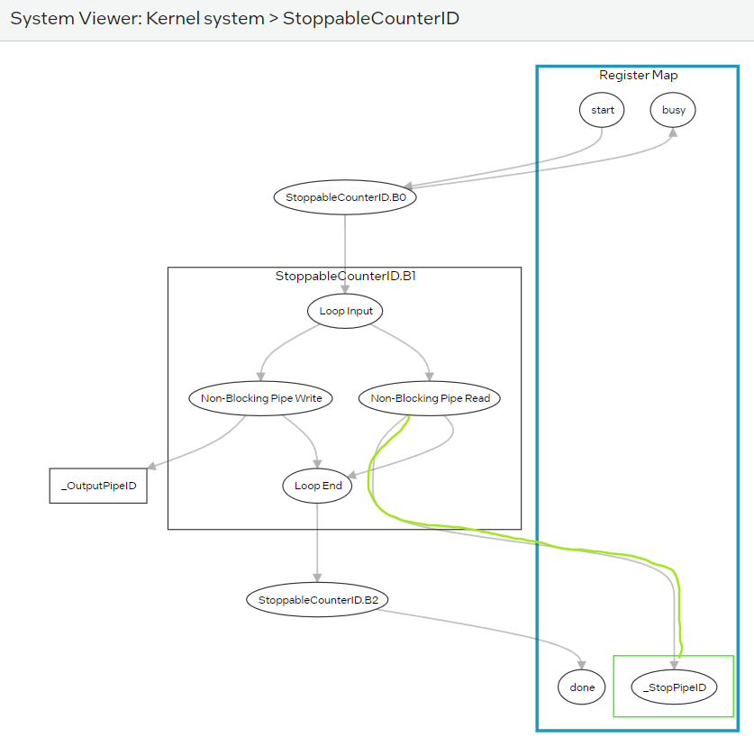
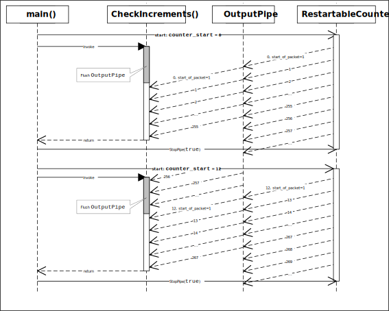

# `Restartable Streaming Kernel` Sample

This tutorial demonstrates how to make a streaming kernel that can be stopped at any time by the host application, then restarted again at a later time. The technique shown in this tutorial lets you dynamically terminate your kernel while it runs, allowing it to load a new set of kernel arguments.

| Optimized for       | Description                                                                                 |
| :------------------ | :------------------------------------------------------------------------------------------ |
| OS                  | Ubuntu* 20.04 <br> RHEL*/CentOS* 8 <br> SUSE* 15 <br> Windows* 10 <br> Windows Server* 2019 |
| Hardware            | Intel® Agilex® 7, Agilex® 5, Arria® 10, Stratix® 10, and Cyclone® V FPGAs                   |
| Software            | Intel® oneAPI DPC++/C++ Compiler                                                            |
| What you will learn | Best practices for creating and managing a oneAPI FPGA project                              |
| Time to complete    | 10 minutes                                                                                  |

> **Note**: Even though the Intel DPC++/C++ oneAPI compiler is enough to compile for emulation, generating reports and generating RTL, there are extra software requirements for the simulation flow and FPGA compiles.
>
> To use the simulator flow, Intel® Quartus® Prime Pro Edition (or Standard Edition when targeting Cyclone® V) and one of the following simulators must be installed and accessible through your PATH:
>
> - Questa\*-Intel® FPGA Edition
> - Questa\*-Intel® FPGA Starter Edition
> - ModelSim® SE
>
> When using the hardware compile flow, Intel® Quartus® Prime Pro Edition (or Standard Edition when targeting Cyclone® V) must be installed and accessible through your PATH.
>
> :warning: Make sure you add the device files associated with the FPGA that you are targeting to your Intel® Quartus® Prime installation.

> **Note**: In oneAPI full systems, kernels that use SYCL Unified Shared Memory (USM) host allocations or USM shared allocations (and therefore the code in this tutorial) are only supported by Board Support Packages (BSPs) with USM support. Kernels that use these types of allocations can always be used to generate standalone IPs.

## Prerequisites

This sample is part of the FPGA code samples.
It is categorized as a Tier 3 sample that demonstrates a design pattern.

```mermaid
flowchart LR
   tier1("Tier 1: Get Started")
   tier2("Tier 2: Explore the Fundamentals")
   tier3("Tier 3: Explore the Advanced Techniques")
   tier4("Tier 4: Explore the Reference Designs")

   tier1 --> tier2 --> tier3 --> tier4

   style tier1 fill:#0071c1,stroke:#0071c1,stroke-width:1px,color:#fff
   style tier2 fill:#0071c1,stroke:#0071c1,stroke-width:1px,color:#fff
   style tier3 fill:#f96,stroke:#333,stroke-width:1px,color:#fff
   style tier4 fill:#0071c1,stroke:#0071c1,stroke-width:1px,color:#fff
```

Find more information about how to navigate this part of the code samples in the [FPGA top-level README.md](/README.md).
You can also find more information about [troubleshooting build errors](/README.md#troubleshooting), [links to selected documentation](/README.md#documentation), etc.

## Purpose

This tutorial demonstrates how to add a `stop` register to allow a host application to kill (or reset) your kernel at any point. This design pattern is useful in applications where you want your kernel to run for some indefinite number of iterations that can't be communicated ahead of time. For example, consider a situation where you want your kernel to periodically re-launch with new kernel arguments when something happens that only the host is aware of, such as an input device disconnecting, or some amount of time passing. 

## Key Implementation Details

The key to implementing this behavior is to create a `while()` loop that terminates when a 'stop' signal is seen on a pipe interface. Pipe interfaces (unlike kernel arguments) can be read multiple times during a kernel's execution, so you can use them to send messages to your kernel while it executes. The `while()` loop continues iterating until the host application (or even a different kernel) writes a `true` into the `StopPipe`. We use **non-blocking** pipe operations to guarantee that the kernel checks *all* of its pipe interfaces every clock cycle. It is important to use non-blocking pipe reads and writes, because blocking pipe operations may take some time to respond. If the kernel is blocking on a different pipe operation, it will not respond to a write to the `StopPipe` interface.

```c++
[[intel::initiation_interval(1)]]  // NO-FORMAT: Attribute
while (keep_going) {
  // Use non-blocking operations to ensure that the kernel can check all its
  // pipe interfaces every clock cycle, even if one or more data interfaces
  // are stalling (asserting valid = 0) or back-pressuring (asserting ready
  // = 0).
  bool did_write = false;
  PipePayloadType beat = <...>;
  OutputPipe::write(beat, did_write);

  // Only adjust the state of the kernel if the pipe write succeeded.
  // This is logically equivalent to blocking.
  if (did_write) {
    counter++;
  }

  // Use non-blocking operations to ensure that the kernel can check all its
  // pipe interfaces every clock cycle.
  bool did_read_keep_going = false;
  bool stop_result = StopPipe::read(did_read_keep_going);
  if (did_read_keep_going) {
    keep_going = !stop_result;
  }
}
```

In this sample, `StopPipe` has been assigned the `protocol::avalon_mm_uses_ready` property so it is mapped to the kernel's control/status register (CSR) instead of a streaming interface. Mapping to the CSR allows this kernel to be managed by a memory-mapped host (such as a Nios® V softcore processor), but mapping to a streaming interface is convenient if this kernel were to be managed by another SYCL kernel. For details about the `protocol::avalon_mm_uses_ready` property, see the [CSR Pipes](/Tutorials/Features/hls_flow_interfaces/component_interfaces_comparison/csr-pipes) sub-sample within the [Component Interfaces Comparison](/Tutorials/Features/hls_flow_interfaces/component_interfaces_comparison) code sample.



The testbench in `main.cpp` exercises the kernel in the following steps:

1. Initialize the counter kernel with an initial value of 7.
2. Read a sequence of 256 outputs from the kernel, which should be a monotonically growing sequence starting at 7.
3. Read 256 more outputs from the kernel, which should be a monotonically growing sequence starting at 263.
4. Stop the kernel.
5. Initialize the kernel with a new initialization value of 77.
6. Read 256 more outputs from the kernel, which should be a monotonically growing sequence starting at 77.

### Packets

This design uses the Avalon `start_of_packet` signal to indicate when the a new set of values is being written to `OutputPipe`. The `start_of_packet` sideband signal is not *generally* necessary for implementing a restartable streaming kernel, but it is used in this design to compensate for the decoupled way that the `RestartableCounter` kernel executes with respect to the host code. Since the host code does not tell `RestartableCounter` how many values to write to `OutputPipe`, the `RestartableCounter` will continue to write to `OutputPipe` until either:

1. `OutputPipe` fills up, in which case the `RestartableCounter` kernel will stop incrementing its internal counter until the pipe can be written to again, or 

2. A `true` is written to the `StopPipe`.

Any data written to the `OutputPipe` between the host code writing a `true` to `StopPipe`, and the `RestartableCounter` kernel *consuming* the `true` from `StopPipe` will still be in `OutputPipe` the next time the host code tries to read from it, so it is necessary to flush these extra beats of data. The `start_of_packet` sideband signals the beginning of a new stream of counter data in `OutputPipe`.



## Building the `restartable_streaming_kernel` Tutorial

> **Note**: When working with the command-line interface (CLI), you should configure the oneAPI toolkits using environment variables.
> Set up your CLI environment by sourcing the `setvars` script located in the root of your oneAPI installation every time you open a new terminal window.
> This practice ensures that your compiler, libraries, and tools are ready for development.
>
> Linux\*:
>
> - For system wide installations: `. /opt/intel/oneapi/setvars.sh`
> - For private installations: ` . ~/intel/oneapi/setvars.sh`
> - For non-POSIX shells, like csh, use the following command: `bash -c 'source <install-dir>/setvars.sh ; exec csh'`
>
> Windows\*:
>
> - `C:\"Program Files (x86)"\Intel\oneAPI\setvars.bat`
> - Windows PowerShell\*, use the following command: `cmd.exe "/K" '"C:\Program Files (x86)\Intel\oneAPI\setvars.bat" && powershell'`
>
> For more information on configuring environment variables, see [Use the setvars Script with Linux* or macOS*](https://www.intel.com/content/www/us/en/develop/documentation/oneapi-programming-guide/top/oneapi-development-environment-setup/use-the-setvars-script-with-linux-or-macos.html) or [Use the setvars Script with Windows\*](https://www.intel.com/content/www/us/en/develop/documentation/oneapi-programming-guide/top/oneapi-development-environment-setup/use-the-setvars-script-with-windows.html).

Use these commands to run the design, depending on your OS.

### On a Linux\* System

This design uses CMake to generate a build script for GNU/make.

1. Change to the sample directory.

2. Configure the build system for the Agilex® 7 device family, which is the default.

   ```
   mkdir build
   cd build
   cmake ..
   ```

   > **Note**: You can change the default target by using the command:
   >
   > ```
   > cmake .. -DFPGA_DEVICE=<FPGA device family or FPGA part number>
   > ```

3. Compile the design. (The provided targets match the recommended development flow.)

   1. Compile for emulation (fast compile time, targets emulates an FPGA device).
      ```
      make fpga_emu
      ```
   2. Generate the HTML optimization reports.
      ```
      make report
      ```
   3. Compile for simulation (fast compile time, targets simulator FPGA device).
      ```
      make fpga_sim
      ```
   4. Compile with Quartus place and route (To get accurate area estimate, longer compile time).
      ```
      make fpga
      ```

### On a Windows\* System

This design uses CMake to generate a build script for `nmake`.

1. Change to the sample directory.

2. Configure the build system for the Agilex® 7 device family, which is the default.

   ```
   mkdir build
   cd build
   cmake -G "NMake Makefiles" ..
   ```

   You can create a debuggable binary by setting `CMAKE_BUILD_TYPE` to `Debug`:

   ```
   mkdir build
   cd build
   cmake -G "NMake Makefiles" .. -DCMAKE_BUILD_TYPE=Debug
   ```

   If you want to use the `report`, `fpga_sim`, or `fpga` flows, you should switch the `CMAKE_BUILD_TYPE` back to `Release``:

   ```
   cmake -G "NMake Makefiles" .. -DCMAKE_BUILD_TYPE=Release
   ```

   > **Note**: You can change the default target by using the command:
   >
   > ```
   > cmake -G "NMake Makefiles" .. -DFPGA_DEVICE=<FPGA device family or FPGA part number>
   > ```


3. Compile the design. (The provided targets match the recommended development flow.)

   1. Compile for emulation (fast compile time, targets emulated FPGA device).
      ```
      nmake fpga_emu
      ```
   2. Generate the optimization report. 
      ```
      nmake report
      ```
   3. Compile for simulation (fast compile time, targets simulator FPGA device).
      ```
      nmake fpga_sim
      ```
   4. Compile with Quartus place and route (To get accurate area estimate, longer compile time).
      ```
      nmake fpga
      ```

   > **Note**: If you encounter any issues with long paths when compiling under Windows\*, you may have to create your 'build' directory in a shorter path, for example `C:\samples\build`. You can then run cmake from that directory, and provide cmake with the full path to your sample directory, for example:
   >
   > ```
   > C:\samples\build> cmake -G "NMake Makefiles" C:\long\path\to\code\sample\CMakeLists.txt
   > ```

## Run the `restartable_streaming_kernel` Executable

### On Linux

1. Run the sample on the FPGA emulator (the kernel executes on the CPU).
   ```
   ./restartable.fpga_emu
   ```
2. Run the sample on the FPGA simulator device.
   ```
   CL_CONTEXT_MPSIM_DEVICE_INTELFPGA=1 ./restartable.fpga_sim
   ```

### On Windows

1. Run the sample on the FPGA emulator (the kernel executes on the CPU).
   ```
   restartable.fpga_emu.exe
   ```
2. Run the sample on the FPGA simulator device.
   ```
   set CL_CONTEXT_MPSIM_DEVICE_INTELFPGA=1
   restartable.fpga_sim.exe
   set CL_CONTEXT_MPSIM_DEVICE_INTELFPGA=
   ```

## Example Output

```
Running on device: Intel(R) FPGA Emulation Device

Start kernel RestartableCounter at 7. 
Flush pipe until 'start of packet' is seen.
        Flushed 0 beats.
Start counting from 7
Start counting from 263
Stop kernel RestartableCounter

Start RestartableCounter at 77.
Flush pipe until 'start of packet' is seen.
        Flushed 239107 beats.
Start counting from 77
Stop kernel RestartableCounter
PASSED
```

## License

Code samples are licensed under the MIT license. See
[License.txt](/License.txt) for details.

Third party program Licenses can be found here: [third-party-programs.txt](/third-party-programs.txt).
