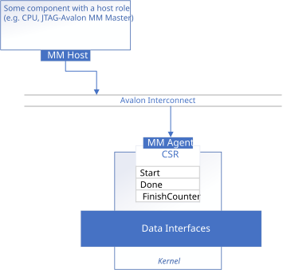
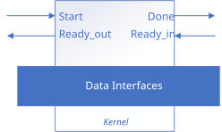
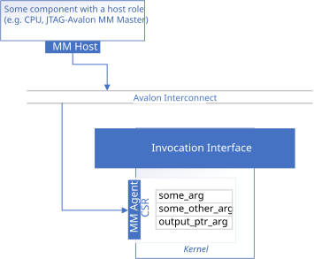
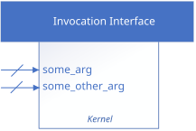
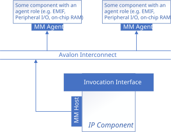
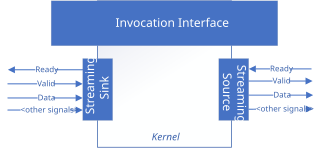
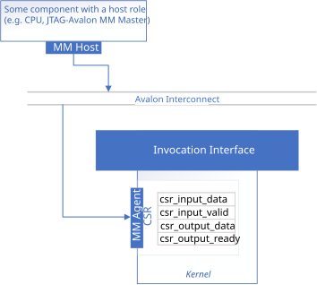
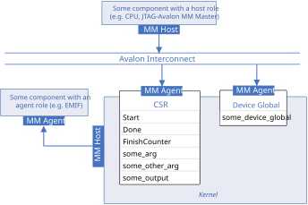

# Component Interfaces Comparison

This sample introduces the different external interfaces that an FPGA IP component can have when created with the HLS IP Gen Compiler.

| Area                 | Description
|:---                  |:---
| What you will learn  | The kinds of external interfaces the HLS IP Gen compiler can produce on your generated IP, and how to configure them
| Time to complete     | 60 minutes
| Category             | Concepts and Functionality

## Prerequisites

| Optimized for        | Description
|:---                  |:---
| OS                   | Ubuntu* 20.04, Ubuntu* 22.04, Ubuntu* 24.04 <br> RHEL* 9 <br> SUSE* 15 <br> **NOTE: Windows is not supported**
| Hardware             | Agilex® 3, Agilex® 5, Agilex® 7, Stratix® 10 and Arria® 10 FPGAs
| Software             | HLS IP Gen Compiler

> **Note**: Even though the HLS IP Gen Compiler is enough to compile for emulation, generating reports and generating RTL, there are extra software requirements for the simulation flow and FPGA compiles.
>
> For using the simulator flow, Quartus® Prime Pro Edition (or Standard Edition when targeting Cyclone® V) and one of the following simulators must be installed and accessible through your PATH:
> - Questa*-Altera® FPGA Edition
> - Questa*-Altera® FPGA Starter Edition
> - ModelSim® SE
>
> When using the hardware compile flow, Quartus® Prime Pro Edition (or Standard Edition when targeting Cyclone® V) must be installed and accessible through your PATH.

> **Warning**: Make sure you add the device files associated with the FPGA that you are targeting to your Quartus® Prime installation.

This sample is part of the FPGA code samples. It is categorized as a Tier 1 sample that helps you getting started.


Find more information about how to navigate this part of the code samples in the [FPGA top-level README.md](/README.md).
You can also find more information about [troubleshooting build errors](/README.md#troubleshooting), [links to selected documentation](/README.md#documentation), and more.

## Interfaces Overview

<!--When you create an FPGA multi-architecture binary for an accelerator card equipped with a board support package (BSP), the HLS IP Gen Compiler will infer a set of interfaces for you that fits your selected BSP. -->
Interfaces on an FPGA IP component facilitate communication between the component and the external system it is connected to. They can be categorized along two axes: **interface type** (the underlying protocol) and **interface functionality** (what the interface is used for). You can customize which interfaces are generated on your IP by the HLS IP Gen Compiler.

While IP component interfaces can also carry signals such as IRQ and clock/reset, these signals are not configurable and this code sample focuses on the interfaces used for kernel control and data transfer.

### Interface Types

The following interface types may appear on an IP component:

- **Memory-Mapped (MM)**: An address-based interface where a **host** reads and writes registers or memory locations in an **agent** by driving an address, read/write control signals, and data lines. The host initiates every transaction; the agent responds. The IP component can act as either role: as an agent (exposing its control/status registers to an external host) or as a host (issuing read/write requests to external memory). Currently there is only one protocol supported for this type of interface:
  - [Avalon® memory-mapped (host/agent)](https://docs.altera.com/r/docs/683091/22.3/avalon-interface-specifications/avalon-memory-mapped-interfaces)
- **Streaming**: A unidirectional, point-to-point data transfer interface based on a ready/valid handshake. Data flows from a **source** to a **sink** whenever both `valid` (source has data) and `ready` (sink can accept) are asserted. Unlike memory-mapped interfaces, streaming interfaces have no address and transfer data in FIFO order. Possible protocols for this type of interface include:
  - [Avalon streaming (source/sink)](https://docs.altera.com/r/docs/683091/22.3/avalon-interface-specifications/avalon-streaming-interfaces)
  - [AXI streaming (source/sink)](https://developer.arm.com/documentation/ihi0051/b/?lang=en)
- **Conduit**: A simple, direct-wired interface consisting of one or more individual signals with no fixed protocol. Used to implement a streaming-like interface with no handshaking requirements.

### Interface Functionalities

An IP component interface serves one of the following functionalities. The rest of this README covers each in detail.

- **[Kernel interfaces](#kernel-interfaces)** — derived from the kernel invocation and argument configuration.
  - **[Kernel invocation](#invocation-interface)**: Start the kernel execution and query its status (busy, done, finish count). Exposed either as registers in the shared control/status registers (CSR) (register-mapped invocation) or as dedicated conduit ports (streaming invocation).
  - **[Kernel arguments](#kernel-argument-interfaces)**: Deliver argument values that are captured at kernel invocation. Arguments can be written to CSR registers (register-mapped) or presented on dedicated conduit ports (streaming). Pointer arguments additionally require one or more [external memory interfaces](#external-memory-interface).
- **[Non-kernel interfaces](#non-kernel-interfaces)** — interfaces that are not directly used for kernel invocation or argument passing.
  - **[External memory access](#external-memory-interface)**: When the kernel uses pointer arguments that refer to data in external memory (e.g. off-chip DDR, on-chip block RAM), the compiler generates one or more memory-mapped host interface(s) so the kernel can issue read/write requests to that memory.
  - **[Data streaming](#streaming-pipes)**: Host pipes configured with streaming protocols provide streaming data links between the kernel and the outside world. Data can flow in either direction and can be transferred while the kernel is running, with flow control handled by the ready/valid handshake.
  - **[CSR-mapped data](#csr-mapped-pipes-avalon-mm-protocol)**: Host pipes configured with the memory-mapped protocol expose their data and valid signals as registers in the shared CSR, allowing the host to read or write pipe values by polling a register address.
  - **[Host-accessible global data](#device-globals-with-host-access)**: Device globals declared with a `host_access` property that is not `none` generate a dedicated memory-mapped agent interface, separate from the shared CSR, that allows an external host to read from or write to persistent on-device variables.

> **Note**: All functionalities that are implemented with the CSR share a **single** Avalon MM agent interface on the IP component. They are accessed at different register addresses within that shared CSR, not through separate interfaces.

### Functionality vs. Type Matrix

<table>
<tr>
  <th>Functionality</th>
  <th>Interface Type</th>
  <th>Main Sample</th>
</tr>
<tr>
  <td rowspan="2">Kernel invocation</td>
  <td>Avalon MM (agent, shared)</td>
  <td><a href="naive/">naive</a></td>
</tr>
<tr>
  <td>Conduit</td>
  <td><a href="streaming-invocation/">streaming-invocation</a></td>
</tr>
<tr>
  <td rowspan="2">Kernel arguments</td>
  <td>Avalon MM (agent, shared)</td>
  <td><a href="naive/">naive</a></td>
</tr>
<tr>
  <td>Conduit</td>
  <td><a href="streaming-invocation/">streaming-invocation</a></td>
</tr>
<tr>
  <td>External memory access</td>
  <td>Avalon MM (host)</td>
  <td><a href="mm-host/">mm-host</a></td>
</tr>
<tr>
  <td>Data streaming (Streaming pipes)</td>
  <td>Avalon streaming or AXI streaming</td>
  <td><a href="pipes/">pipes</a></td>
</tr>
<tr>
  <td>CSR-mapped data (CSR pipes)</td>
  <td>Avalon MM (agent, shared)</td>
  <td><a href="csr-pipes/">csr-pipes</a></td>
</tr>
<tr>
  <td>Host-accessible global data (Device global)</td>
  <td>Avalon MM (agent, independent)</td>
  <td><a href="device-global/">device-global</a></td>
</tr>
</table>

## Kernel Interfaces

Kernel interfaces are the interfaces generated directly from your kernel's invocation mechanism and its arguments. They consist of an *invocation interface* (how the kernel is started and signals completion) and *kernel argument interfaces* (how argument values are delivered to the kernel).

### Invocation Interface

The invocation interface controls how your system starts the IP component and how the component signals completion. It can be configured to use one of the following two interface types.

#### Register-Mapped (CSR)

The invocation signals (`start`, `done`, etc.) are implemented as registers in the kernel CSR, which is exposed as an Avalon memory-mapped agent interface. A host system controls the kernel by reading and writing to these CSR registers. This is the default invocation interface.



You should use a register-mapped invocation interface when your component is controlled by a host that communicates over an Avalon memory-mapped interconnect. This kind of invocation interface is demonstrated in the [Naive Design](naive).

#### Streaming (Ready/Valid Handshake)

The invocation signals appear as dedicated conduit ports (`start`, `ready_out`, `done`, `ready_in`) on the IP component. The external system drives `start` to request a kernel launch and `ready_in` to indicate it can accept completion. The kernel drives `ready_out` when it is ready to accept a new invocation and `done` when it has finished. The kernel begins execution on the clock cycle when both `start` and `ready_out` are asserted.



You should use a streaming invocation interface when your component will be driven by another IP that uses a ready/valid protocol, or when you want to pipeline multiple kernel invocations. See the [streaming-invocation](streaming-invocation) example.

### Kernel Argument Interfaces

Kernel argument interfaces can also be configured to be either register-mapped or streaming. By default, unannotated arguments inherit the style of the invocation interface: CSR arguments for a register-mapped invocation, conduit arguments for a streaming invocation. You can override this default using `annotated_arg` to mix and match.

#### Register-Mapped (CSR) Arguments

When kernel arguments are passed through the IP component's CSR, each argument occupies a register at a known byte address. This is the default argument interface for kernels with a register-mapped invocation interface, as shown in the [Naive Design](naive).



There are two argument types:

- **Scalar arguments**: The value is written directly to the CSR register. No additional interfaces are needed.
- **Pointer arguments**: The pointer *address* is written to the CSR register, but the kernel also needs to access the data in external memory that the pointer refers to. To enable this access, the compiler generates a [memory-mapped host interface](#external-memory-interface) on the IP component.

#### Conduit Arguments

Arguments can be presented as dedicated input conduit ports on the IP. Conduit arguments are the default for kernels with a streaming invocation interface. Each argument gets its own port, and argument values are captured on the clock cycle when the streaming invocation handshake fires (`start` && `ready_out`). The [streaming-invocation](streaming-invocation) example demonstrates a streaming kernel with streaming kernel arguments.

You can also explicitly request conduit arguments on a register-mapped kernel using `annotated_arg` with the `conduit` property. If the kernel uses a register-mapped invocation interface with conduit arguments, then the values are captured when the `start` register is written.



As with CSR arguments, conduit pointer arguments deliver only the address through the conduit port. The compiler still generates [memory-mapped host interfaces](#external-memory-interface) for the kernel to access the external memory that the pointers refer to.

## Non-Kernel Interfaces

Non-kernel interfaces are external interfaces on the IP component that are not directly used for kernel invocation or argument passing.

### External Memory Interface

When the kernel uses pointer arguments that refer to data in external memory (e.g. off-chip DDR or on-chip block RAM in the surrounding system), the compiler generates one or more Avalon memory-mapped host interface(s) on the IP component. In this interface the IP acts as the Avalon host and the external memory acts as the agent.

By default, all pointer arguments (whether delivered via CSR or conduit) share a single memory-mapped host interface. You can use `annotated_arg` with the `buffer_location` property to assign pointer arguments to different external memories, which causes the compiler to generate a separate Avalon memory-mapped host interface for each unique `buffer_location`. Additional properties like `dwidth`, `latency`, `read_write_mode`, and `alignment` let you customize each interface individually. The [mm-host](mm-host/) example under this code sample demonstrates how to create additional memory-mapped host interfaces. For more details on the properties, see the dedicated [mmhost](/Tutorials/Features/hls_flow_interfaces/mmhost) code sample.



### Host Pipes

Pipes are constructs that provide data links between elements of a design. There are two kinds: **host pipes**, which connect a kernel to the outside world, and **inter-kernel pipes**, which connect kernels to each other internally. Inter-kernel pipes are entirely internal to the device image and do not create any ports on the IP component interface. This section focuses on **host pipes**, which do generate external interfaces.

The HLS IP Gen Compiler maps each host pipe to an external interface on the IP component. The protocol used by the pipe determines what kind of external interface is generated.

Unlike kernel arguments (whether passed through the CSR or as conduits), which are input-only and captured once at kernel invocation, host pipes can transfer data in either direction (host-to-kernel or kernel-to-host) and can be read or written at any time while the kernel is running. Host pipes also provide flow control signals so that the sender and receiver can coordinate data transfers.

For an introductory explanation on the pipes feature, see the [host pipes](/Tutorials/Features/experimental/hostpipes) code sample.

#### Streaming Pipes

Host pipes generate a streaming interface on the IP component, with signals for data and ready-valid handshaking.



By default, the interface uses an Avalon streaming protocol, but AXI streaming protocol may also be used by setting the `protocol_name::axi_streaming` property. This is suitable for connecting to other streaming IP in your system. See the dedicated [streaming_data_interfaces](/Tutorials/Features/hls_flow_interfaces/streaming_data_interfaces) code sample for details on configuring Avalon and AXI streaming interfaces.

The [pipes](pipes/) example demonstrates basic reading input and writing output through Avalon streaming host pipes.

#### CSR-Mapped Pipes (Avalon MM Protocol)

Host pipes can also be mapped into the IP component's CSR by setting the `protocol_name::avalon_mm` protocol. The pipe data and valid signals appear as registers in the CSR address space, accessible through the same Avalon MM agent interface used for kernel invocation. This is useful when you want to read or write a value from the host side by polling a register.



The [csr-pipes](csr-pipes/) example demonstrates using CSR-mapped pipes.

> **Warning**: Using CSR-mapped pipes with a streaming invocation interface yields undefined behavior. CSR-mapped pipes should only be used with a register-mapped invocation interface.

### Device Globals with Host Access

Device globals (`device_global`) are global variables that live on the FPGA device. Their state is preserved across kernel invocations for the lifetime of the loaded device image, making them useful for configuration registers, status outputs, or any persistent data that must be accessible by the host without being tied to a specific kernel invocation.



The `host_access` property controls the direction: `read`, `write`, `read_write`, or `none`. Device globals with the `host_access_none` property are visible only to the IP component, not to the external system, and thus do not generate an external interface. Device globals declared with a `host_access` property that is not `none` generate an external interface that allows an outside host to read from or write to them.

A device global with host access generates its own dedicated Avalon memory-mapped interface on the IP component, independent of the shared CSR. See the [device-global](device-global/) example in this sample, and the dedicated [device_global](/Tutorials/Features/experimental/device_global) code sample for more details.

## Sample Structure

There are 6 different example designs in this sample, all of which implement a simple vector addition. You can compare the C++ source code for each of these designs, with the following recommended order.

### Kernel Interface Examples
1. [Naive](naive/) — A simple vector add with default interfaces: register-mapped (CSR) invocation, CSR arguments, and a single shared memory-mapped host interface.<!-- This is the only design that can support the full-system compilation flow, since the other designs implement interface customizations that are not supported by any BSP.-->
2. [Streaming invocation](streaming-invocation/) — Uses a streaming invocation interface with conduit arguments and a single shared memory-mapped host data interface.

### Non-Kernel Interface Examples
3. [Customized MM Host](mm-host/) — Uses a register-mapped invocation interface with `annotated_arg` to create separate, customized memory-mapped host interfaces per pointer argument.
4. [Streaming Data (pipes)](pipes/) — Uses Avalon streaming host pipes for input and output data.
5. [CSR Data (csr-pipes)](csr-pipes/) — Uses CSR-mapped host pipes for input and output data.
6. [Device Global](device-global/) — Uses a `device_global` with `host_access_write` to maintain state across kernel invocations, generating a dedicated Avalon MM interface.

## Build a Design

All designs in this sample support four compilation options: Emulator, Simulator, Optimization Report, FPGA Hardware. For details on the different compilation options, see the [fpga_compile](/Tutorials/GettingStarted/fpga_compile) tutorial.

Use the appropriate TYPE parameter when running CMake to config which design to compile:
| Example                                      | Directory             | Type (-DTYPE=) |
|----------------------------------------------|-----------------------|----------------|
| Naive                                        | naive/                | NAIVE          |
| Streaming invocation                         | streaming-invocation/ | STREAMING      |
| Customized memory-mapped host data interface | mm-host/              | MMHOST         |
| Streaming Data (pipes)                       | pipes/                | PIPES          |
| CSR Data                                     | csr-pipes/            | CSR            |
| Device Global                                | device-global/        | DEVGLOB        |


> **Note**: When working with the command-line interface (CLI), you should configure the HLS IP Gen Compiler using environment variables. 
> Set up your CLI environment by sourcing the `fpgavars` script located in the root of your HLS IP Gen Compiler installation every time you open a new terminal window. 
> This practice ensures that your compiler, libraries, and tools are ready for development.
>
> Linux*:
> - `source <install-dir>/fpgavars.sh`
> - For non-POSIX shells, like csh, use the following command: `bash -c 'source <install-dir>/fpgavars.sh ; exec csh'`

### On Linux*

1. Change to the sample directory.
2. Configure the build system for the Agilex™ 7 device family, which is the default.

   ```
   mkdir build
   cd build
   cmake .. -DTYPE=<NAIVE/CSR/STREAMING/PIPES/MMHOST/DEVGLOB>
   ```

   > **Note**: You can change the default target by using the following command. **Targeting a BSP is not supported.**
   >  ```
   >  cmake .. -DFPGA_DEVICE=<FPGA device family or FPGA part number> -DTYPE=<NAIVE/CSR/STREAMING/PIPES/MMHOST/DEVGLOB>
   >  ``` 

3. Compile the design. (The provided targets match the recommended development flow.)

   1. Compile for emulation (fast compile time, targets emulated FPGA device).
      ```
      make fpga_emu
      ```
      >**Note**: Since this design uses host pipes, make sure that the emulator pipe depth behaviour is as intended. Set the environment variable `CL_CONFIG_CHANNEL_DEPTH_EMULATION_MODE` to `ignore-depth` for this design so that multiple writes can happen to the pipe without first having the contents read.

   2. Compile for simulation (fast compile time, targets simulator FPGA device):
      ```
      make fpga_sim
      ```

   3. Generate HTML performance report.
      ```
      make report
      ```
      The report resides at `vector_add.report.prj/reports/report.html`.

   4. Compile with Quartus place and route (To get accurate area estimate, longer compile time).
      ```
      make fpga
      ```

## Run the Design

### On Linux

#### Run on FPGA Emulator

1. Run the sample on the FPGA emulator (the kernel executes on the CPU).
   ```
   ./vector_add.fpga_emu
   ```

#### Run on FPGA Simulator

1. Run the sample on the FPGA simulator.
   ```
   CL_CONTEXT_MPSIM_DEVICE_INTELFPGA=1 ./vector_add.fpga_sim
   ```

## License
Code samples are licensed under the MIT license. See
[License.txt](/License.txt) for details.

Third party program Licenses can be found here: [third-party-programs.txt](/third-party-programs.txt).
