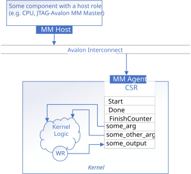

# CSR Host Pipe Interfaces

This sample demonstrates how to configure host pipes to use a CSR-mapped data interface.

> **Warning**: Using CSR-mapped pipes with a streaming invocation interface yields undefined behavior. CSR-mapped pipes should only be used with a register-mapped invocation interface.



## Interface Summary

<table>
  <tr>
    <th>Interface</th>
    <th>Type</th>
    <th>Variable</th>
  </tr>
  <tr>
    <td>Kernel invocation</td>
    <td rowspan="5">Avalon® MM agent (CSR)</td>
    <td>N/A</td>
  </tr>
  <tr>
    <td>Kernel argument</td>
    <td><code>len</code></td>
  </tr>
  <tr>
    <td rowspan="3">Host pipe</td>
    <td><code>InputPipeA</code></td>
  </tr>
  <tr>
    <td><code>InputPipeB</code></td>
  </tr>
  <tr>
    <td><code>OutputPipeC</code></td>
  </tr>
</table>

## CSR Pipe Interface

In this design, the inputs `InputPipeA`, `InputPipeB` and the output `OutputPipeC` are all host pipes configured with the `protocol_name::avalon_mm` protocol so that their data, ready, and valid signals are mapped into the IP component's CSR rather than appearing as separate streaming interfaces.

To configure a host pipe to map to the CSR, set its protocol as `protocol_name::avalon_mm` (from `sycl::ext::altera::experimental` namespace).

Alternatively, you can use the following property shorthands:
- `sycl::ext::altera::experimental::protocol_avalon_mm`

Although this example uses CSR pipes to pass vector data to the kernel element by element, CSR-mapped pipes are more commonly used for sending control signals rather than bulk data. For a more representative use case, see the [convolution 2D](/ReferenceDesigns/convolution2d) reference design.

<!-- TODO: Add link to CSR pipe example and maybe also refer to the handbook? -->
This design is meant to illustrate the IP component interface generated by register-mapped host pipes. For a more complete description of host pipe usages, each parameter and a list of properties can be found in the [Host Pipes](/Tutorials/Features/experimental/hostpipes) and the [Streaming Data Interfaces](/Tutorials/Features/hls_flow_interfaces/streaming_data_interfaces) code sample.

### CSR Pipe Behavior

Unlike streaming (Avalon ST) host pipes, CSR pipes are register-mapped (each pipe occupies a single register in the CSR with a depth of 1). The `min_capacity` template parameter does not apply to CSR pipes and is ignored by the compiler.

Because CSR pipes are not FIFO-based, throughput is not tracked and the host cannot pre-fill all pipe data before launching the kernel the way it can with streaming pipes. CSR pipe read/write behaves as follows:

- **Blocking** read/write: a corresponding write/read on the other side must complete before the next read/write can proceed.
- **Non-blocking** read/write: if no corresponding write/read has occurred since the last access, a read may return stale data and a write may overwrite data that has not yet been consumed.

In this example, the host interleaves writes and reads within a single loop so that each iteration writes one pair of inputs and reads one output:

```cpp
for (int i = 0; i < count; i++) {
  InputPipeA::write(q, a[i]);
  InputPipeB::write(q, b[i]);
  int calc = OutputPipeC::read(q);
}
```

## Example Output

```
Add two vectors of size 256
PASSED
```

You can find the address of the output CSR in `vector_add.<target>.prj/include/kernel_headers/IDSimpleVAdd_register_map.h`:

```cpp
/* Status register contains all the control bits to control kernel execution */
/******************************************************************************/
/* Memory Map Summary                                                         */
/******************************************************************************/

/*
 Address | Access | Register     | Argument                            | Description 
---------|--------|--------------|-------------------------------------|-------------------------------
     0x0 |      R |   reg0[63:0] |                        Status[63:0] |         * Read the status bits
         |        |              |                                     |       that are described below
---------|--------|--------------|-------------------------------------|-------------------------------
     0x8 |      W |   reg1[31:0] |                         Start[31:0] |        * Write 1 to initiate a
         |        |              |                                     |                   kernel start
---------|--------|--------------|-------------------------------------|-------------------------------
    0x30 |      R |   reg6[31:0] |                 FinishCounter[31:0] | * Read to get number of kernel
         |        |  reg6[63:32] |                 FinishCounter[31:0] |       finishes, note that this
         |        |              |                                     |    register will clear on read
---------|--------|--------------|-------------------------------------|-------------------------------
    0x80 |      W |  reg16[31:0] |                       arg_len[31:0] |                              
---------|--------|--------------|-------------------------------------|-------------------------------
    0x88 |    R/W |  reg17[63:0] | acl_c_IDPipeA_pipe_channel_data[63:0] |         * Input host pipe data
---------|--------|--------------|-------------------------------------|-------------------------------
    0x90 |    R/W |  reg18[63:0] | acl_c_IDPipeA_pipe_channel_valid[63:0] |        * Input host pipe valid
         |        |              |                                     |            write 1 to indicate
         |        |              |                                     |            data register holds
         |        |              |                                     |                     valid data
---------|--------|--------------|-------------------------------------|-------------------------------
    0x98 |    R/W |  reg19[63:0] | acl_c_IDPipeB_pipe_channel_data[63:0] |         * Input host pipe data
---------|--------|--------------|-------------------------------------|-------------------------------
    0xa0 |    R/W |  reg20[63:0] | acl_c_IDPipeB_pipe_channel_valid[63:0] |        * Input host pipe valid
         |        |              |                                     |            write 1 to indicate
         |        |              |                                     |            data register holds
         |        |              |                                     |                     valid data
---------|--------|--------------|-------------------------------------|-------------------------------
    0xa8 |      R |  reg21[63:0] | acl_c_IDPipeC_pipe_channel_data[63:0] |        * Output host pipe data
---------|--------|--------------|-------------------------------------|-------------------------------
    0xb0 |    R/W |  reg22[63:0] | acl_c_IDPipeC_pipe_channel_ready[63:0] |       * Output host pipe ready
         |        |              |                                     |            write 1 to indicate
         |        |              |                                     |           kernel may overwrite
         |        |              |                                     |                  data register

...

*/
```

## License

Code samples are licensed under the MIT license. See
[License.txt](/License.txt) for details.

Third party program Licenses can be found here: [third-party-programs.txt](/third-party-programs.txt).
