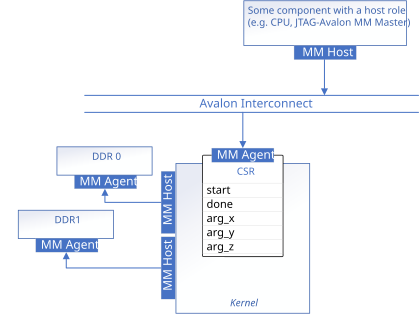

# Memory-Mapped Host Interfaces

This implementation uses a register-mapped invocation interface, and demonstrates how to use `annotated_arg` to customize the memory-mapped host data interface.



## Interface Summary

<table>
  <tr>
    <th>Interface</th>
    <th>Type</th>
    <th>Variable</th>
  </tr>
  <tr>
    <td>Kernel invocation</td>
    <td rowspan="5">Avalon® MM agent (CSR)</td>
    <td>N/A</td>
  </tr>
  <tr>
    <td rowspan="4">Kernel argument</td>
    <td><code>a_in</code> (pointer address)</td>
  </tr>
  <tr>
    <td><code>b_in</code> (pointer address)</td>
  </tr>
  <tr>
    <td><code>c_out</code> (pointer address)</td>
  </tr>
  <tr>
    <td><code>len</code></td>
  </tr>
  <tr>
    <td rowspan="3">External memory</td>
    <td>Avalon MM host (customized, <code>buffer_location<1></code>)</td>
    <td><code>a_in</code> (data)</td>
  </tr>
  <tr>
    <td>Avalon MM host (customized, <code>buffer_location<2></code>)</td>
    <td><code>b_in</code> (data)</td>
  </tr>
  <tr>
    <td>Avalon MM host (customized, <code>buffer_location<3></code>)</td>
    <td><code>c_out</code> (data)</td>
  </tr>
</table>

## Memory-Mapped Host Interface

Since the pointer arguments refer to data in external memory, the compiler generates memory-mapped host interfaces for the kernel to access that memory. You can customize these interfaces by declaring your pointer arguments with the templated type `annotated_arg`. In this example, the memory-mapped host interfaces for `a_in`, `b_in`, and `c_out` are each customized this way.

### Using `annotated_arg`

To customize a memory-mapped host interface, declare the pointer argument as an `annotated_arg` member in your kernel functor. The following example shows how to specify properties such as `buffer_location`, `dwidth`, `latency`, `read_write_mode`, and `alignment`:

```cpp
sycl::ext::oneapi::experimental::annotated_arg<
      int *, decltype(sycl::ext::oneapi::experimental::properties{
                 sycl::ext::altera::experimental::buffer_location<1>,
                 sycl::ext::altera::experimental::dwidth<32>,
                 sycl::ext::altera::experimental::latency<0>,
                 sycl::ext::altera::experimental::read_write_mode_read,
                 sycl::ext::oneapi::experimental::alignment<4>})>
      a_in;
```

A full list of properties that can be used with `annotated_arg` can be found in the dedicated [mmhost](/Tutorials/Features/hls_flow_interfaces/mmhost) code sample.

## Example Output

```
Add two vectors of size 256
PASSED
```

## License

Code samples are licensed under the MIT license. See
[License.txt](/License.txt) for details.

Third party program Licenses can be found here: [third-party-programs.txt](/third-party-programs.txt).
