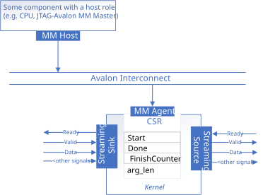

# Streaming Host Pipe Interfaces

This sample demonstrates how to configure host pipes to use a streaming data interface.



## Interface Summary

<table>
  <tr>
    <th>Interface</th>
    <th>Type</th>
    <th>Variable</th>
  </tr>
  <tr>
    <td>Kernel invocation</td>
    <td rowspan="2">Avalon® MM agent (CSR)</td>
    <td>N/A</td>
  </tr>
  <tr>
    <td>Kernel argument</td>
    <td><code>len</code></td>
  </tr>
  <tr>
    <td rowspan="3">Host pipe</td>
    <td>Avalon streaming (sink)</td>
    <td><code>InputPipeA</code></td>
  </tr>
  <tr>
    <td>Avalon streaming (sink)</td>
    <td><code>InputPipeB</code></td>
  </tr>
  <tr>
    <td>Avalon streaming (source)</td>
    <td><code>OutputPipeC</code></td>
  </tr>
</table>

## Host Pipe Streaming Interface

In this design, `InputPipeA`, `InputPipeB`, and `OutputPipeC` are implemented as streaming host pipes — FIFO buffers that provide streaming data links between the kernel and the outside world.

Host pipe streaming interfaces may appear similar to streaming kernel arguments (see the [streaming-invocation](../streaming-invocation) example), but there are key differences:

- **Direction**: Streaming kernel arguments are input-only — output data must go through a pointer to external memory, and the host can only read the results after the kernel finishes. Host pipes support both input and output directions.
- **Timing**: Streaming kernel arguments must be available in memory before the kernel is invoked. Host pipes can stream data into and out of the kernel while it is running.

This makes host pipes well suited for designs where data arrives incrementally or where the producer and consumer operate concurrently.

This design is meant to illustrate the IP component interface generated by streaming host pipes. For a more complete description of host pipe usages, each parameter and a list of properties can be found in the [Host Pipes](/Tutorials/Features/experimental/hostpipes) and the [Streaming Data Interfaces](/Tutorials/Features/hls_flow_interfaces/streaming_data_interfaces) code sample.

### Declaring a Pipe

Each pipe is a declaration of the templated `pipe` class:

```cpp
sycl::ext::altera::experimental::pipe<id, type, min_capacity, properties>;
```

#### Example of Pipe Declaration

```cpp
using PipeProps = decltype(sycl::ext::oneapi::experimental::properties(
    sycl::ext::altera::experimental::ready_latency<0>));
class ID_PipeA;
using InputPipeA =
    sycl::ext::altera::experimental::pipe<ID_PipeA, int, 0, PipeProps>;
```

### Pipe API

Pipes expose read and write interfaces that allow a single element to be read or written in FIFO order to the pipe.

#### Example of Pipe API

```cpp
// Device-side: read and write inside kernel code
int a_val = InputPipeA::read();
OutputPipeC::write(a_val);

// Host-side: read and write require a sycl::queue argument
InputPipeA::write(q, 42);
int result = OutputPipeC::read(q);
```

## Example Output

```
Add two vectors of size 256
PASSED
```

## License

Code samples are licensed under the MIT license. See
[License.txt](/License.txt) for details.

Third party program Licenses can be found here: [third-party-programs.txt](/third-party-programs.txt).
