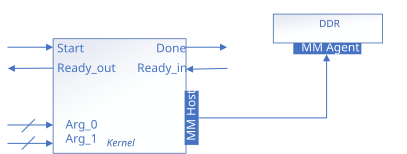

# Streaming Invocation and Conduit Arguments

This implementation uses a streaming invocation interface, and conduits to pass the kernel arguments instead of the CSR. It uses a single, shared memory-mapped host data interface.

This design also shows how to specify conduit interfaces using `annotated_arg`.



## Interface Summary

<table>
  <tr>
    <th>Interface</th>
    <th>Type</th>
    <th>Variable</th>
  </tr>
  <tr>
    <td>Kernel invocation</td>
    <td>Conduit</td>
    <td>N/A</td>
  </tr>
  <tr>
    <td rowspan="4">Kernel argument</td>
    <td>Conduit</td>
    <td><code>a_in</code> (pointer address)</td>
  </tr>
  <tr>
    <td>Conduit</td>
    <td><code>b_in</code> (pointer address)</td>
  </tr>
  <tr>
    <td>Conduit</td>
    <td><code>c_out</code> (pointer address)</td>
  </tr>
  <tr>
    <td>Conduit</td>
    <td><code>len</code></td>
  </tr>
  <tr>
    <td>External memory</td>
    <td>Avalon® MM host (single shared)</td>
    <td>shared by <code>a_in</code>, <code>b_in</code>, <code>c_out</code> (data)</td>
  </tr>
</table>

## Streaming Invocation Interface

In this design, the `SimpleVAdd` kernel uses a streaming invocation interface. This is explicitly specified using kernel properties. The following member function is added to the kernel functor to specify kernel properties:

```cpp
auto get(sycl::ext::oneapi::experimental::properties_tag) {
    return sycl::ext::oneapi::experimental::properties{
        sycl::ext::altera::experimental::streaming_interface<>
    };
}
```

The property `sycl::ext::altera::experimental::streaming_interface<>` configures a streaming invocation interface with a `ready_in` interface to allow down-stream components to backpressure. You can choose to remove the `ready_in` interface by using `sycl::ext::altera::experimental::streaming_interface_remove_downstream_stall` instead. If you omit the `streaming_interface` property, the compiler will configure your kernel with a register-mapped invocation interface.

Detailed explanation of invocation interfaces can be found in this dedicated [Invocation Interfaces](/Tutorials/Features/hls_flow_interfaces/invocation_interfaces) code sample.

## Streaming Kernel Argument Interface

In this design, all kernel arguments (`a_in`, `b_in`, `c_out`, `len`) are implemented as conduits. In kernels with a streaming invocation interface, all unannotated arguments will be implemented as conduits by default. In kernels with a register-mapped invocation interface, all unannotated arguments will be implemented in the control/status register by default. In this design, they are explicitly specified as conduits to demonstrate the `annotated_arg` wrapper with property `sycl::ext::altera::experimental::conduit`.

Since `a_in`, `b_in` and `c_out` are pointers, they will share an Avalon memory-mapped host interface.

## Example Output

```
Add two vectors of size 256
PASSED
```

## License

Code samples are licensed under the MIT license. See
[License.txt](/License.txt) for details.

Third party program Licenses can be found here: [third-party-programs.txt](/third-party-programs.txt).
