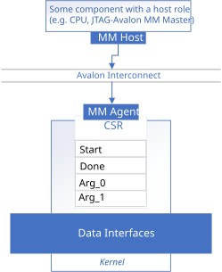
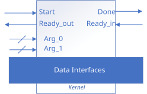
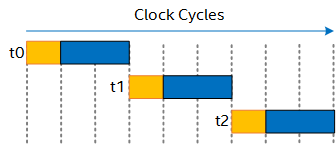
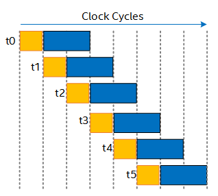
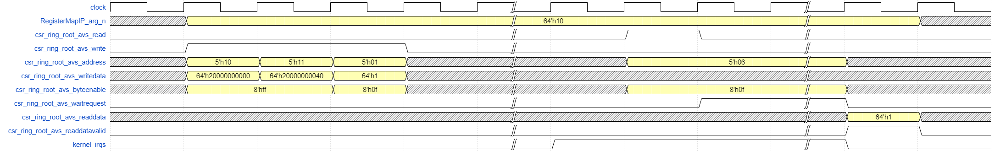
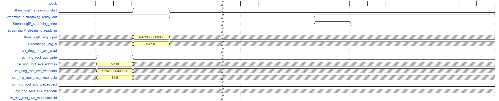
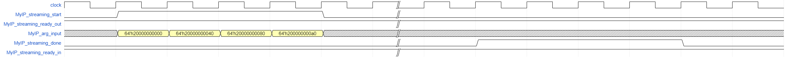

# `Invocation Interfaces` Sample

This sample demonstrates how to specify the kernel invocation interface and kernel argument interface for an FPGA IP produced with the HLS IP Gen Compiler.

| Area                 | Description
|:--                   |:--
| What you will learn  | Basics of configuring kernel invocation interfaces and kernel argument interfaces
| Time to complete     | 30 minutes
| Category             | Concepts and Functionality

## Purpose

This sample demonstrates the differences between streaming invocation interfaces that use a ready/valid handshake and register-mapped invocation interfaces that exist in the control/status register (CSR) of FPGA IP produced with the HLS IP Gen Compiler.

Use the `get` kernel properties method to specify how the IP is started, and `annotated_arg` wrapper to specify how arguments are passed to the IP.

## Prerequisites

| Optimized for        | Description
|:---                  |:---
| OS                   | Ubuntu* 20.04, Ubuntu* 22.04, Ubuntu* 24.04 <br> RHEL* 9 <br> SUSE* 15 <br> **NOTE: Windows is not supported**
| Hardware             | Agilex® 3, Agilex® 5, Agilex® 7, Stratix® 10 and Arria® 10 FPGAs
| Software             | HLS IP Gen Compiler

> **Note**: Even though the HLS IP Gen compiler is enough to compile for emulation, generating reports and generating RTL, there are extra software requirements for the simulation flow and FPGA compiles.
>
> For using the simulator flow, Quartus® Prime Pro Edition (or Standard Edition when targeting Cyclone® V) and one of the following simulators must be installed and accessible through your PATH:
> - Questa*-Altera® FPGA Edition
> - Questa*-Altera® FPGA Starter Edition
> - ModelSim® SE
>
> When using the hardware compile flow, Quartus® Prime Pro Edition (or Standard Edition when targeting Cyclone® V) must be installed and accessible through your PATH.

> **Warning** Make sure you add the device files associated with the FPGA that you are targeting to your Quartus® Prime installation.

This sample is part of the FPGA code samples.
It is categorized as a Tier 2 sample that demonstrates a compiler feature.


Find more information about how to navigate this part of the code samples in the [FPGA top-level README.md](/README.md).
You can also find more information about [troubleshooting build errors](/README.md#troubleshooting), [links to selected documentation](/README.md#documentation), and more.

## Key Implementation Details

The sample demonstrates in detail how to declare kernel invocation interfaces and kernel argument interfaces.

### Understanding Register-Mapped and Streaming Interfaces

The kernel invocation interface (namely, the `start` and `done` signals) can be implemented in the kernel's CSR, or using a ready/valid handshake. Similarly, the kernel arguments can be passed through the CSR, or through dedicated conduits.

| Register-mapped Invocation with Register-mapped Arguments | Streaming Invocation with Conduit Arguments
|:--:                                                       |:--:
|                   | 

The invocation interface and any argument interfaces are specified independently, so you may choose to implement the invocation interface with a ready/valid handshake and implement the kernel arguments in the CSR, or vice versa. The following table lists valid kernel argument interface synchronizations.

| Invocation Interface    | Argument Interface    | Argument Interface Synchronization
|:---                     |:---                   |:---
| Register-mapped         | Register-mapped       | Consumed if written any time before writing to the `start` register 
| Register-mapped         | Conduit               | Consumed one clock cycle after writing to the `start` register 
| Streaming               | Conduit               | Consumed when `<kernel_name>_streaming_start`=1 and `<kernel_name>_streaming_ready_out`=1 
| Streaming               | Register-mapped       | Consumed if written one clock cycle before `<kernel_name>_streaming_start`=1 and `<kernel_name>_streaming_ready_out`=1 

Note that streaming kernel arguments (conduit) only open a single data port on the IP interface and are sampled once upon kernel invocation. If you would like to stream data into or out of the kernel as it runs, use a [streaming data interface](../streaming_data_interfaces/), which provides a dedicated ready/valid handshake for continuous data transfer.

## Customizing the Kernel Invocation Interface

### Declaring a Register-Mapped Invocation Interface

By default, your IP's `start` and `done` signals will appear in the IP's CSR. This is true whether you declare your kernel using the 'functor' or 'lambda' syntax.

<table>
<tr>
  <th>Functor Syntax</th>
  <th>Lambda Syntax</th>
</tr>
<tr>
  <td style="vertical-align: top;">

```c++
struct MyIP {
  ...
  void operator()() const {
    ...
  }
};

...

q.single_task(MyIP{});
```

  </td>
  <td style="vertical-align: top;">

```c++
void myIPFunction() {
  ...
}

...

q.single_task([=] {
  myIPFunction();
  ...
});
```

  </td>
</tr>
</table>

You can see concrete examples of kernels that use register-mapped invocation interfaces in:
  - [`src/reg_map_functor.cpp`](src/reg_map_functor.cpp)
  - [`src/reg_map_lambda.cpp`](src/reg_map_lambda.cpp)

### Declaring a Streaming Invocation Interface

You can force your IP's `start` and `done` signals to appear as signals on your IP boundary by adding the `streaming_interface` kernel property.

The `streaming_interface` property has two variants:

- `sycl::ext::altera::experimental::streaming_interface<accept_downstream_stall>`
  -  Configures a streaming invocation interface **with** a `ready_in` port, allowing downstream components to backpressure the kernel.
  - The alias `sycl::ext::altera::experimental::streaming_interface_accept_downstream_stall` is equivalent.
  - Using `streaming_interface<>` (no template argument) also defaults to this variant.
- `sycl::ext::altera::experimental::streaming_interface<remove_downstream_stall>`
  - Configures a streaming invocation interface **without** a `ready_in` port.
  - The alias `sycl::ext::altera::experimental::streaming_interface_remove_downstream_stall` is equivalent.

If you omit the `streaming_interface` property entirely, the compiler will configure your kernel with a register-mapped invocation interface.

The syntax for declaring a kernel property differs between functor and lambda syntax, but the `streaming_interface` property itself is the same.  If you declare your kernel using the functor syntax, you must declare your kernel properties in the `get()` function; if you declare your kernel using the lambda syntax, you must declare your kernel properties in an object that you pass to the `single_task()` function.

<table>
<tr>
  <th>Functor Syntax</th>
  <th>Lambda Syntax</th>
</tr>
<tr>
  <td style="vertical-align: top;">

```c++
struct MyIP {
  ...
  auto get(sycl::ext::oneapi::experimental::properties_tag) {
      return sycl::ext::oneapi::experimental::properties {
          sycl::ext::altera::experimental::streaming_interface<>
      };
  }
  void operator()() const {
    ...
  }
};

...

q.single_task(MyIP{});
```

  </td>
  <td style="vertical-align: top;">

```c++
void myIPFunction() {
  ...
}

...

sycl::ext::oneapi::experimental::properties kernel_properties {
  sycl::ext::altera::experimental::streaming_interface<>,
};

q.single_task(kernel_properties, [=] {
  myIPFunction();
  ...
})
```

  </td>
</tr>
</table>

You can see concrete examples of kernels that use streaming invocation interfaces in:
  - [`src/stream_functor.cpp`](src/stream_functor.cpp)
  - [`src/stream_lambda.cpp`](src/stream_lambda.cpp)
  - [`src/stream_rm_stall.cpp`](src/stream_rm_stall.cpp) (`ready_in` signal disabled)

#### Pipelined Streaming Invocation Interface

SYCL* task kernels are non-pipelined by default, meaning the next kernel invocation can only be started after the previous one has completed its execution. Kernels with a streaming kernel invocation interface can optionally be pipelined to increase the throughput of the kernel. A pipelined kernel is one that can be invoked while the previous kernel invocation is still executing, making full use of the entire hardware pipeline. The delay between successive invocations is called the initiation interval (II).

| Non-pipelined Invocation | Pipelined Invocation with II=1
|:--:                      |:--:
|  | 

The kernel property `sycl::ext::altera::experimental::pipelined` takes an optional template parameter that controls whether to pipeline the kernel. Valid parameters are:
- **-1**: Pipeline the kernel, and automatically infer lowest possible II at target fMAX.
- **0**: Do not pipeline the kernel.
- **N (N > 0)**: Pipeline the kernel, and force the II of the kernel to be N.

If a parameter is not specified, the default parameter of `-1` will be inferred, so the compiler will make its best effort to achieve the lowest kernel II.

> **Note**: The `sycl::ext::altera::experimental::pipelined<>` property only supports task (non-NDRange) kernels with a streaming invocation interface.

When you invoke a kernel with a pipelined streaming interface, you should only call the `wait()` blocking function after all kernel invocations have launched.

```c++
for (int i = 0; i < count; i++) {
	q.single_task<StreamPipelined>(StreamPipelinedIP{&input[i], &functor_streaming_pipelined_out[i]});
}
q.wait();
```

> **Note**: As per the SYCL language semantics, separate invocations of a kernel are **independent**. This means that you can't make assumptions about memory ordering or memory dependences between kernel invocations. Make sure you use synchronization mechanisms such as the `.wait()` function or *atomic operations* to avoid race conditions.  
> If you want to guarantee sequential equivalence, you can also write your kernel with a `while(1)` loop in the kernel body instead of using a pipelined kernel.  
> In particular, a repeatedly-invoked kernel with a memory dependence will result in undefined behavior in SYCL and may not function as you expect. 

You can see a concrete example of a kernel that uses pipelined streaming invocation interfaces in:
  - [`src/stream_pipelined.cpp`](src/stream_pipelined.cpp)

## Customizing the Kernel Argument Interface

While this example primarily focuses on the invocation interface, you can also customize the kernel argument interfaces as described below.

You can use the `sycl::ext::oneapi::experimental::annotated_arg` wrapper type to customize whether a kernel argument should be passed to the IP component as a conduit, or through the CSR. If you do not specify an `annotated_arg` wrapper, the compiler will infer an argument interface based on your invocation interface.

| Invocation Interface | Automatically Inferred Argument Interface | SYCL Property
|:--                   |:--                                        |:--
| Register-mapped      | Register-mapped                           | `sycl::ext::altera::experimental::register_map`
| Streaming            | Conduit                                   | `sycl::ext::altera::experimental::conduit`

You can add a `conduit` property to an `annotated_arg` like this:

```c++
struct MyIP {
  sycl::ext::oneapi::experimental::annotated_arg<
    int, decltype(sycl::ext::oneapi::experimental::properties {
                  sycl::ext::altera::experimental::conduit})>
  arg1;

  void operator()() const {
    ...
    // access arg1 here
  }
};
```

> **Note**: If you use a `struct` or `class` type as the payload of an `annotated_arg`, you must cast away the `annotated_arg` wrapper to access the members and methods of your `struct` or `class`. In particular, this applies to `ac_int` types. If you forget to cast away the `annotated_arg` wrapper and try to access members or methods anyway, you will see a compiler error.
> 
> ```c++
> using MyUInt5 = ac_int<5, false>;
> 
> struct FunctorRegMapIP {
> 
>   int *input;
>   int *output;
> 
>   // A kernel with a register map invocation interface can also independently
>   // have streaming kernel arguments, when annotated by 'conduit' property.
>   sycl::ext::oneapi::experimental::annotated_arg<
>     MyUInt5, decltype(sycl::ext::oneapi::experimental::properties{
>                   sycl::ext::altera::experimental::conduit})>
>     n;
> 
>   // Without kernel invocation interface annotation, a register-mapped invocation
>   // interface will be inferred by the compiler.
>   void operator()() const {
>     // For annotated_arg of ac_int type, explicitly cast away the annotated_arg
>     // to prevent compiler error when using methods or accessing members.
>     for (MyUInt5 i = 0; i < ((MyUInt5)n).slc<5>(0); i++) { 
>       output[i] = input[i] * (input[i] + 1);
>     }
>   }
> };
> ```
> This is demonstrated in `src/reg_map_functor.cpp`, `src/reg_map_lambda.cpp` and `src/stream_functor.cpp`.

## Source File Summary

This code sample contains 6 source files that together demonstrate a full spectrum of configuration options for IP component invocation interfaces.

| Source File | Invocation Interface | Coding Style | Argument Interfaces |
|:---|:---|:---|:---|
| [`src/reg_map_functor.cpp`](src/reg_map_functor.cpp) | Register-mapped | Functor | Register-mapped (explicit `annotated_arg`) |
| [`src/reg_map_lambda.cpp`](src/reg_map_lambda.cpp) | Register-mapped | Lambda | Register-mapped (explicit `annotated_arg`) |
| [`src/stream_functor.cpp`](src/stream_functor.cpp) | Streaming (non-pipelined) | Functor | Conduit (explicit `annotated_arg`)<br>Register-mapped (explicit `annotated_arg`) |
| [`src/stream_lambda.cpp`](src/stream_lambda.cpp) | Streaming (non-pipelined) | Lambda | Conduit (implied) |
| [`src/stream_pipelined.cpp`](src/stream_pipelined.cpp) | Streaming (pipelined) | Functor | Conduit (implied) |
| [`src/stream_rm_stall.cpp`](src/stream_rm_stall.cpp) | Streaming (non-pipelined, stall-free) | Functor | Register-mapped (explicit `annotated_arg`)<br>Conduit (explicit `annotated_arg`) |

## Build the `Invocation Interfaces` Tutorial

> **Note**: When working with the command-line interface (CLI), you should configure the HLS IP Gen Compiler using environment variables. Set up your CLI environment by sourcing the `fpgavars` script in the root of your HLS IP Gen Compiler installation every time you open a new terminal window. This practice ensures that your compiler, libraries, and tools are ready for development.
>
> Linux*:
> - `source <install-dir>/fpgavars.sh`
> - For non-POSIX shells, like csh, use the following command: `bash -c 'source <install-dir>/fpgavars.sh ; exec csh'`

### On Linux*

1. Change to the sample directory.
2. Build the program for Agilex® 7 device family, which is the default.
   ```
   mkdir build
   cd build
   cmake .. -DPART=<X>
   ```
   where `X` is:
   - `REG_MAP_FUNCTOR`
   - `STREAM_FUNCTOR`
   - `STREAM_RM_STALL`
   - `REG_MAP_LAMBDA`
   - `STREAM_LAMBDA`
   - `STREAM_PIPELINED`
   > **Note**: You can change the default target by using the following command. **Targeting a BSP is not supported.**
   >  ```
   >  cmake .. -DPART=<X> -DFPGA_DEVICE=<FPGA device family or FPGA part number>
   >  ```

3. Compile the design. (The provided targets match the recommended development flow.)

   1. Compile and run for emulation (fast compile time, targets emulates an FPGA device).
      ```
      make fpga_emu
      ```
   2. Generate the HTML optimization reports. (See [Read the Reports](#read-the-reports) below for information on finding and understanding the reports.)
      ```
      make report
      ```
   3. Compile for simulation (:warning: This design compiles many source files, so the simulation compilation may take up to 3 hours depending on your computer).
      ```
      make fpga_sim
      ```
   4. Run the generated HDL through Quartus® Prime to generate accurate f<sub>MAX</sub> and area estimates.
      > **Warning**: The FPGA executables generated in this tutorial are **not** supported to be run on FPGA devices directly.
      ```
      make fpga
      ```

### Read the Reports

1. Locate `report.html` in the corresponding `build/vector_add.report.prj/reports/` directory, and open it in a browser.

2. Open the **Views** menu and select **System Viewer**.

3. For kernels with a **register-mapped** invocation interface, select **FunctorRegMap** or **LambdaRegMap** under the System hierarchy in the left-hand pane.

   In the main **System Viewer** pane, you will see:
   - The `start`, `busy`, and `done` kernel invocation interfaces are implemented as register-mapped interfaces.
   - The `arg_input` and `arg_output` kernel arguments are implemented as register-mapped interfaces.
   - The `arg_n` kernel argument is implemented as a conduit interface.

4. For kernels with a **streaming** invocation interface, select **FunctorStream**, **StreamRmStall**, **StreamPipelined**, or **LambdaStream** under the System hierarchy in the left-hand pane.

   In the main **System Viewer** pane, you will see:
   - The `start`, `done`, `ready_in`, and `ready_out` kernel invocation interfaces are implemented as streaming interfaces.
     > **Note**: In the report, `ready_in` and `ready_out` are shown as `stall_in` and `stall_out` respectively. The report for **StreamRmStall** shows the internals of the kernel, so `stall_in` appears but is tied to ground and not visible at the device image boundary.
   - The `arg_input` kernel argument is implemented as a conduit interface.
   - The `arg_n` kernel argument is implemented as a conduit interface (except for **StreamPipelined**, which does not have this argument).
   - The `arg_output` kernel argument is implemented as a register-mapped interface in **FunctorStream** and **StreamRmStall**, and as a conduit interface in **StreamPipelined** and **LambdaStream**.


## Run the `Invocation Interfaces` Sample

### On Linux

1. Run the sample on the FPGA emulator (the kernel executes on the CPU).
   ```
   ./vector_add.fpga_emu
   ```
2. Run the sample on the FPGA simulator.
   ```
   CL_CONTEXT_MPSIM_DEVICE_INTELFPGA=1 ./vector_add.fpga_sim
   ```

## Example Output

### Example Command Line Output

#### Register-Mapped Functor Example Output

```
Running the kernel with register map invocation interface implemented in the functor programming model
	 Done
PASSED
```

#### Streaming Functor Example Output

```
Running the kernel with streaming invocation interface implemented in the functor programming model
	 Done
PASSED
```

#### Streaming Remove Downstream Stall Functor Example Output

```
Running the kernel with streaming invocation interface implemented in the functor programming model
	 Done
PASSED
```

#### Streaming Pipelined Functor Example Output

```
Launching streaming pipelined kernels consecutively
         Done

PASSED
```

#### Register-Mapped Lambda Example Output

```
Running the kernel with register map invocation interface implemented in the lambda programming model
	 Done
PASSED
```

#### Streaming Lambda Example Output

```
Running the kernel with streaming invocation interface implemented in the lambda programming model
	 Done
PASSED
```

### Example Simulation Waveform

The diagram below shows the example waveform generated by the simulator that you will see for the kernels with a register-mapped invocation interface. The waveform shows the register-mapped kernel arguments and kernel invocation handshaking signals are passed in through an Avalon agent interface, whose addresses are as specified in the agent memory map header files in the project directory.



The diagram below shows the example waveform generated by the simulator that you will see for the kernels with a streaming invocation interface. The waveform shows the streaming kernel arguments and kernel invocation handshaking signals follow the Avalon-ST protocol. The register map arguments need to be written before the `start` signal is asserted. The streaming invocation interface consumes the streaming kernel arguments on the clock cycle that the `start` and `ready_out` signals are asserted, and the kernel invocation is finished on the clock cycle that the `done` and `ready_in` signals are asserted.



The diagram below shows the example waveform generated by the simulator that you will see for the pipelined kernel design. The waveform shows that the kernel is always ready, and 4 consecutive kernel invocations are launched with the `start` signal being asserted for 4 consecutive clock cycles. When the 4 kernel execution finishes, the `done` signal is asserted for 4 consecutive clock cycles.



## License

Code samples are licensed under the MIT license. See [License.txt](/License.txt) for details.

Third party program Licenses can be found here: [third-party-programs.txt](/third-party-programs.txt).
