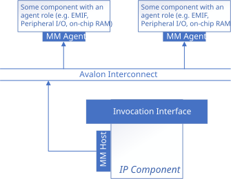
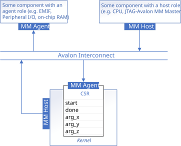
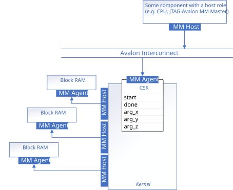
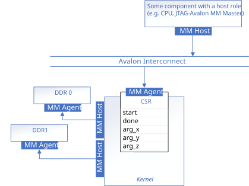

# Memory-Mapped Host Interfaces (mmhost) Sample

This tutorial demonstrates how to configure Avalon® memory-mapped (MM) host data interfaces for IP components produced with the HLS IP Gen Compiler.

| Optimized for                     | Description
---                                 |---
| OS                                | Ubuntu* 20.04, Ubuntu* 22.04, Ubuntu* 24.04 <br> RHEL* 9 <br> SUSE* 15 <br> **NOTE: Windows is not supported**
| Hardware                          | Agilex® 3, Agilex® 5, Agilex® 7, Stratix® 10 and Arria® 10 FPGAs
| Software                          | HLS IP Gen Compiler
| What you will learn               | How to configure Avalon memory-mapped host interfaces with USM pointers or SYCL* accessors in your FPGA IP components
| Time to complete                  | 45 minutes

> **Note**: Even though the HLS IP Gen compiler is enough to compile for emulation, generating reports and generating RTL, there are extra software requirements for the simulation flow and FPGA compiles.
>
> For using the simulator flow, Quartus® Prime Pro Edition (or Standard Edition when targeting Cyclone® V) and one of the following simulators must be installed and accessible through your PATH:
> - Questa*-Altera® FPGA Edition
> - Questa*-Altera® FPGA Starter Edition
> - ModelSim® SE
>
> When using the hardware compile flow, Quartus® Prime Pro Edition (or Standard Edition when targeting Cyclone® V) must be installed and accessible through your PATH.

> **Note**: Make sure you add the device files associated with the FPGA that you are targeting to your Quartus® Prime installation.

## Prerequisites

This sample is part of the FPGA code samples.
It is categorized as a Tier 2 sample that demonstrates a compiler feature.


Find more information about how to navigate this part of the code samples in the [FPGA top-level README.md](/README.md).
You can also find more information about [troubleshooting build errors](/README.md#troubleshooting), [links to selected documentation](/README.md#documentation), etc.

## Purpose

This tutorial demonstrates how the compiler generates Avalon memory-mapped (MM) host data interfaces for kernels that access external memory through USM pointer arguments or SYCL accessors. An Avalon MM host interface allows an IP component to send read or write requests to one or more Avalon MM agent interfaces.

There are two ways to configure these interfaces:

- **USM pointers with `annotated_arg`:** Wrap pointer arguments with `sycl::ext::oneapi::experimental::annotated_arg` and apply properties such as `buffer_location` to customize each interface individually. This tutorial focuses primarily on this approach.
- **SYCL accessors with `accessor_property_list`:** Apply the `buffer_location` property to a SYCL accessor via `sycl::ext::oneapi::accessor_property_list` to assign it to a specific external memory.

To learn more about Avalon MM host interfaces and Avalon MM agent interfaces, refer to the [Avalon Memory-Mapped Interfaces](https://docs.altera.com/r/docs/683091/22.3/avalon-interface-specifications/avalon-memory-mapped-interfaces) specifications.



The compiler generates Avalon MM host interfaces whenever a kernel includes one or more pointer-type arguments (USM pointers or SYCL accessors). By default, all pointer arguments share a single Avalon MM host interface, and each pointer argument follows the kernel's invocation interface — `register_map` (CSR) for register-mapped kernels, or `conduit` for streaming kernels. For USM pointers, you can customize the generated Avalon MM host interface per argument using `annotated_arg` properties (this tutorial focuses on pointer arguments that produce MM host interfaces; `annotated_arg` can also be applied to non-pointer arguments, but those are outside the scope of this tutorial). SYCL accessors always use the compiler's default interface configuration and can only specify `buffer_location` via `accessor_property_list`. You cannot mix USM pointers with SYCL accessors.

In this tutorial, pointer-type arguments with specified `buffer_location` are refered to as *annotated pointer arguments*, otherwise they are referred to as *unannotated pointer arguments*. HLS IP Gen Compiler also provides a `annotated_ptr` wrapper class that is similar to `annotated_arg` but serves slightly different functionality. `annotated_ptr` is not to be confused with the annotated pointer arguments discussed in this tutorial. For more details on `annotated_ptr`, see the [`annotated_ptr`](../../experimental/annotated_ptr) sample.

For more details on invocation interfaces and kernel argument interfaces, see the [Component Interfaces Comparison](../component_interfaces_comparison) sample.

## USM Pointers

USM pointers by default generates a single Avalon MM host interface. They can be configured to generate individual interfaces with different settings by using the `annotated_arg` template class.

The following table describes the properties under `sycl::ext::altera::experimental` that can be used to customize kernel argument interfaces (how the pointer argument is passed to the component). `register_map` and `conduit` are mutually exclusive; `stable` can be used with either `register_map` or `conduit`, or it can be used on its own. These properties may be applied to non-pointer-type kernel arguments as well.

| Parameter        | Description
|---               |---
| `register_map`   | Pass the pointer for this MM host interface through the IP component's control/status register.
| `conduit`        | Pass the pointer for this MM host interface through a conduit interface.
| `stable`         | User guarantee that the pointer will not change between pipelined invocations of the kernel. The compiler uses this to further optimize the kernel. Only useful when the kernel has a [pipelined streaming invocation interface](../invocation_interfaces/README.md#pipelined-streaming-invocation-interface).

The following parameters are found under `sycl::ext::altera::experimental`, with the exception of `alignment` under `sycl::ext::oneapi::experimental`. All properties other than `buffer_location` can only be specified if `buffer_location` is specified. They can only be applied to USM pointer arguments to configure an IP component's Avalon MM host interfaces:

| Parameter                | Default Value | Description
|---                       |---            |---
|  `buffer_location<id>`   | N/A           | The address space of the interface that associates with the host. Each unique buffer location will result in a unique Avalon MM host interface. When `buffer_location` is not specified, then the pointer can be used to access any of the IP's Avalon MM host interfaces depending on which memory the pointer points to.
| `awidth<width>`          | 41            | Width of the Avalon MM host address bus in bits. 
| `dwidth<width>`          | 64            | Width of the Avalon MM host data bus in bits. 
| `latency<value>`         | 0             | Read/Write latency for downstream fixed-latency Avalon MM agent. To interact with a variable-latency Avalon MM agent, set `latency<0>`. 
| `read_write_mode_<mode>` | `readwrite`   | Port direction of the interface. (`readwrite`, `read` or `write`) 
| `maxburst<value>`        | 1             | Maximum number of data transfers that can associate with a read or write request. 
| `alignment<alignment>`   | 1             | Alignment of the pointer.

This tutorial includes three examples that progressively demonstrate how to configure Avalon MM host interfaces using USM pointers:

| Example | Code | Description |
|:---|:---|:---|
| [Example 1: Unannotated Pointer Arguments](#unannotated-pointer-arguments) | [`part1_raw_pointers`](part1_raw_pointers/src/mmhost.cpp) | Unannotated pointer arguments produce a single shared Avalon MM host interface with default settings. |
| [Example 2: Annotated Pointer Arguments](#annotated-pointer-arguments) | [`part2_hosts`](part2_hosts/src/mmhost.cpp) | Assigns each pointer to a dedicated on-chip memory using `buffer_location` and fixed-latency settings, eliminating arbitration and enabling stall-free LSUs. |
| [Example 3: Annotating for Off-Chip Memory Interface](#annotating-for-off-chip-memory-interface) | [`part3_ddr_hosts`](part3_ddr_hosts/src/mmhost.cpp) | Targets off-chip DDR memory with wide data buses, variable latency, burst transactions, alignment, and loop unrolling to maximize bandwidth. |

### Unannotated Pointer Arguments

By default, if all pointer arguments in a kernel are unannotated, they share a single Avalon MM host interface.

```c++
struct PointerIP {
  // Pointer kernel arguments will be passed through the component's CSR. They
  // will refer to data accessible through a shared Avalon MM host interface.
  int *x;
  int *y;
  int *z;
  int size;

  void operator()() const {
    for (int i = 0; i < size; ++i) {
      z[i] = x[i] + y[i];
    }
  }
};
```


> **Note:** Wrapping pointers with `annotated_arg` without specifying `buffer_location` and related properties also result in the same configuration.

### Annotated Pointer Arguments

The default behaviour of a pointer argument can be overridden by declaring an `annotated_arg` kernel argument. This can be used to configure interfaces that interact with on-chip memory agent.

```c++
constexpr int kBL1 = 1;
constexpr int kBL2 = 2;
constexpr int kBL3 = 3;
constexpr int kAlignment = 4;

struct MultiMMIP {
  // Each annotated pointer argument is configured with a unique
  // `buffer_location`, resulting in three unique Avalon MM host interfaces.
  using XProps = decltype(sycl::ext::oneapi::experimental::properties{
      sycl::ext::altera::experimental::buffer_location<kBL1>,
      sycl::ext::altera::experimental::awidth<32>,
      sycl::ext::altera::experimental::dwidth<32>,
      sycl::ext::altera::experimental::latency<1>,
      sycl::ext::oneapi::experimental::alignment<kAlignment>,
      sycl::ext::altera::experimental::read_write_mode_read});
  using YProps = decltype(sycl::ext::oneapi::experimental::properties{
      sycl::ext::altera::experimental::buffer_location<kBL2>,
      sycl::ext::altera::experimental::awidth<32>,
      sycl::ext::altera::experimental::dwidth<32>,
      sycl::ext::altera::experimental::latency<1>,
      sycl::ext::oneapi::experimental::alignment<kAlignment>,
      sycl::ext::altera::experimental::read_write_mode_read});
  using ZProps = decltype(sycl::ext::oneapi::experimental::properties{
      sycl::ext::altera::experimental::buffer_location<kBL3>,
      sycl::ext::altera::experimental::awidth<32>,
      sycl::ext::altera::experimental::dwidth<32>,
      sycl::ext::altera::experimental::latency<1>,
      sycl::ext::oneapi::experimental::alignment<kAlignment>,
      sycl::ext::altera::experimental::read_write_mode_write});

  sycl::ext::oneapi::experimental::annotated_arg<int *, XProps> x;
  sycl::ext::oneapi::experimental::annotated_arg<int *, YProps> y;
  sycl::ext::oneapi::experimental::annotated_arg<int *, ZProps> z;

  int size;

  void operator()() const {
    for (int i = 0; i < size; i++) {
      z[i] = x[i] + y[i];
    }
  }
};
```

These parameters improve the performance of the [Unannotated Pointer Arguments](#unannotated-pointer-arguments) example by ensuring that each pointer points to data in a dedicated Avalon MM agent memory:



### Annotating for Off-Chip Memory Interface

If the input and output vectors are too large for on-chip memory, larger off-chip memories can be used. Consider the parameterization of a system with the following off-chip memory interfaces:

* Two banks of DDR SDRAM
* Data bus of 256 bits
* bursts of up to 8 requests



The available memory bandwidth can be better used by coalescing the 32-bit wide load-store units into wider 256-bit wide load-store units to match the memory interface. By choosing an unroll factor of 8, the compiler may coalesce 8 memory accesses into a single 256 bit access. By specifying the `alignment` property, the compiler can assume the specified `alignment` and infer an optimized LSU. Without this property, a non-aligned LSU is inferred requiring additional logic to handle potential unaligned accesses. When the alignment property is specified on the kernel argument, the same alignment must be specified to the SYCL runtime using `aligned_alloc_shared` as shown in the codesample. 

```c++
struct DDRIP {
  using ParamsBl1 = decltype(sycl::ext::oneapi::experimental::properties{
      sycl::ext::altera::experimental::buffer_location<kBL1>,
      sycl::ext::altera::experimental::maxburst<8>,
      sycl::ext::altera::experimental::dwidth<256>,
      sycl::ext::oneapi::experimental::alignment<kAlignment>,
      sycl::ext::altera::experimental::awidth<32>,
      sycl::ext::altera::experimental::latency<0>});

  using ParamsBl2 = decltype(sycl::ext::oneapi::experimental::properties{
      sycl::ext::altera::experimental::buffer_location<kBL2>,
      sycl::ext::altera::experimental::maxburst<8>,
      sycl::ext::altera::experimental::dwidth<256>,
      sycl::ext::oneapi::experimental::alignment<kAlignment>,
      sycl::ext::altera::experimental::awidth<32>,
      sycl::ext::altera::experimental::latency<0>});

  sycl::ext::oneapi::experimental::annotated_arg<int *, ParamsBl1> x;
  sycl::ext::oneapi::experimental::annotated_arg<int *, ParamsBl1> y;
  sycl::ext::oneapi::experimental::annotated_arg<int *, ParamsBl2> z;
  int size;

  void operator()() const {
#pragma unroll 8
    for (int i = 0; i < size; ++i) {
      z[i] = x[i] + y[i];
    }
  }
};
```

## SYCL Accessors

SYCL accessors can also generate Avalon MM host interfaces. Unlike USM pointers, accessors do not support per-interface customization properties (`dwidth`, `awidth`, `latency`, etc.). The compiler uses default values for those settings, except for `awidth`, which is `35` by default for accessors. However, you can assign accessors to different external memories using the `buffer_location` property via `accessor_property_list`.

> **Important:** Because accessors do not support properties like `dwidth`, `latency`, or `alignment`, they offer less control over the generated interface compared to USM pointers with `annotated_arg`. Prefer USM pointers with `annotated_arg` when you need precise control over the generated Avalon MM interface; use accessors only when the standard SYCL accessor programming model is required.

This tutorial includes one example that demonstrates how to configure Avalon MM host interfaces using SYCL accessors:

| Example | Code | Description |
|:---|:---|:---|
| [Example 4: Annotated Accessors](#annotated-acccessors) | [`part4_accessors`](part4_accessors/src/mmhost.cpp) | Uses SYCL accessors with `accessor_property_list` to assign each accessor to a dedicated memory via `buffer_location`. |

### Annotated Accessors

Given the following functor kernel:

```c++
template <class AccA, class AccB, class AccC>
struct AccessorMMIP {
  AccA x;
  AccB y;
  AccC z;
  int size;

  void operator()() const {
    for (int i = 0; i < size; i++) {
      z[i] = x[i] + y[i];
    }
  }
};
```

To annotate SYCL accessors, create SYCL buffers and construct accessors with `accessor_property_list` to assign each to a different buffer location:

```c++
constexpr int kBL1 = 1;
constexpr int kBL2 = 2;
constexpr int kBL3 = 3;

sycl::buffer buf_a{array_a};
sycl::buffer buf_b{array_b};
sycl::buffer buf_c{array_c};

q.submit([&](sycl::handler &h) {
  sycl::accessor acc_a{buf_a, h, sycl::read_only,
                        sycl::ext::oneapi::accessor_property_list{
                            sycl::ext::altera::buffer_location<kBL1>}};
  sycl::accessor acc_b{buf_b, h, sycl::read_only,
                        sycl::ext::oneapi::accessor_property_list{
                            sycl::ext::altera::buffer_location<kBL2>}};
  sycl::accessor acc_c{buf_c, h, sycl::read_write,
                        sycl::ext::oneapi::accessor_property_list{
                            sycl::ext::altera::buffer_location<kBL3>,
                            sycl::no_init}};

  h.single_task(
      AccessorMMIP<decltype(acc_a), decltype(acc_b), decltype(acc_c)>{
          acc_a, acc_b, acc_c, N});
});
```

This produces three separate Avalon MM host interfaces (one per `buffer_location`), functionally equivalent to Example 2 but using accessors instead of USM pointers. The `no_init` runtime property on `acc_c` tells the runtime it does not need to copy the buffer's previous contents to the device before kernel execution.

### Interfacing Accessor Argument Ports

Each accessor kernel argument generates four 64-bit input interfaces on the IP core. For an accessor named `x`, these are:

| Port | Meaning |
|------|---------|
| `arg_x`      | Pointer address (base address + element offset into memory) |
| `arg_x<n>`   | Access range (number of elements the kernel accesses) |
| `arg_x<n+1>` | Memory range (total buffer size in elements) |
| `arg_x<n+2>` | Offset (starting element offset within the buffer) |

Where `n` is a number based on the number of the accessor kernel arguments used in the kernel.

To see the exact interface names and register offsets, refer to:
- **CSR invocation interface**: `.prj/include/kernel_headers/<kernel_name>_register_map.h`
- **Streaming invocation interface**: `.prj/<executable_name>_di_inst.sv`

When driving these interfaces, always set `arg_x<n+1>` (memory range) to the full buffer size. Set the other ports according to the sub-range you want to access.

> **Note**: When using accessors with `buffer_location`, the compiler emits:
> ```
> The compiler must generate a 64 bit input port for accessor kernel arguments.
> The start address: <some_address> has been assigned to the memory associated
> with the pointer with buffer location <N>. Please specify the base address as
> this start address in your external system.
> ```
> This indicates that for the pointer address port (`arg_x`), you must provide the **start address** shown in the warning (which encodes the buffer location) plus the byte offset into your memory. The IP internally uses this combined address to route accesses to the correct Avalon MM host interface.

## Building the `mmhost` Sample

> **Note**: When working with the command-line interface (CLI), you should configure the HLS IP Gen Compiler using environment variables.
> Set up your CLI environment by sourcing the `fpgavars` script located in the root of your HLS IP Gen Compiler installation every time you open a new terminal window.
> This practice ensures that your compiler, libraries, and tools are ready for development.
>
> Linux*:
> - `source <install-dir>/fpgavars.sh`
> - For non-POSIX shells, like csh, use the following command: `bash -c 'source <install-dir>/fpgavars.sh ; exec csh'`

### On Linux*

This design uses CMake to generate a build script for GNU/make.

1. Change to the sample directory.

2. Configure the build system for the Agilex® 7 device family, which is the default.

   ```
   mkdir build
   cd build
   cmake .. -DTYPE=<TYPE>
   ```

   where `<TYPE>` is: 
   - `PART1` for `part1_pointers`
   - `PART2` for `part2_single_host`
   - `PART3` for `part3_hosts`
   - `PART4` for `part4_ddr_hosts`
   
   > **Note**: You can change the default target by using the following command. **Targeting a BSP is not supported.**
   >  ```
   >  cmake .. -DFPGA_DEVICE=<FPGA device family or FPGA part number> -DTYPE=<TYPE>
   >  ```

3. Compile the design using `make`.
   1. Compile for emulation (fast compile time, targets emulated FPGA device).
      ```
      make fpga_emu
      ```
   2. Compile for simulation (fast compile time, targets simulator FPGA device):
      ```
      make fpga_sim
      ```
   3. Generate HTML performance report. (See [Read the Reports](#read-the-reports) below for information on finding and understanding the reports.)
      ```
      make report
      ```
   4. Compile for FPGA hardware (longer compile time, targets FPGA device).
      ```
      make fpga
      ```

## Examining the Generated RTL

Locate `mmhost_partx_report_di_inst.v` in the `build/mmhost_partx.report.prj/` directory and open it with a text editor. This file demonstrates how to instantiate your IP component using Verilog or System Verilog code.

## Read the Reports

Locate `report.html` in the `build/mmhost_partx.report.prj/reports/` directory. Open the report in a browser of your choice. Each `partx` will have its own report under its own build directory. You can compare multiple reports by opening them in multiple browser windows/tabs. You can also compare multiple reports following the *[HLS IP Gen Handbook](https://docs.altera.com/r/docs/615048/current)*.

### Comparing USM Pointer Single and Multiple Global Memory Interfaces

Navigate to the *Area Estimates* section of the optimization reports for `mmhost_part1` and `mmhost_part2`. The *Kernel System* section on the left panel displays the area consumption of each kernel. Notice that the `MultiMMIP` kernel consumes less area under all categories than the `PointerIP` kernel. This is due to stall-free memory accesses and the removal of arbitration logic. The fixed-latency on-chip block RAMs can be accessed with stall-free load/store units (LSUs), and giving each memory access a single dedicated interface allows the removal of arbitration logic.

Navigate to the *Loop Throughput* section under *Throughput Analysis*: the `MultiMMIP` kernel has a lower latency than the `PointerIP` kernel, and there are less blocks being scheduled. This is because the kernel has access to all 3 memories in parallel without contention.

Observe how the 32-bit LSUs are now coalesced, after unrolling the for-loop.

### Comparing USM Pointer and Accessor Global Memory Interfaces

Navigate to the *Views > System Viewer* section of the optimization reports for `mmhost_part2` and `mmhost_part4`. The *System > Global memory* section on the left panel displays the global memory configurations. Click on the global memory labeled as *1* Under *System > Global memory* for both the `MultiMMIP` kernel and the `AccessorMMIP` kernel, then click on the oval shape with the label *1* in the *System Viewer: Kernel system > Global memory > 1* panel. In the *Details* panel, you should be able to see the detailed configuration of the selected global memory 1.

For the `MultiMMIP` kernel (USM pointers with `annotated_arg`), all interface properties are user-customized:

| Property | Value |
|----------|-------|
| Data Width | 32 |
| Address Width | 32 |
| Latency | 1 |
| ReadWrite Mode | Read Only / Write Only |
| Wait Request | 0 |

For the `AccessorMMIP` kernel (SYCL accessors), all interface properties take default values since accessors do not support `awidth`, `dwidth`, `latency`, or `read_write_mode` annotations:

| Property | Value |
|----------|-------|
| Data Width | 64 |
| Address Width | 35 |
| Latency | 0 |
| ReadWrite Mode | Read/Write |
| Wait Request | 1 |

Note that the accessor's address width is 35 rather than the default 41 (which corresponds to the user address space for host/shared allocations). This is because the compiler computes the address width as `clog2(32 GB)` = 35, based on the maximum addressable memory size per buffer location.

## Run the `mmhost` Sample

### On Linux

1. Run the sample on the FPGA emulator (the kernel executes on the CPU):
   ```
   ./mmhost_partx.fpga_emu
   ```

2. Run the sample on the FPGA simulator device (the kernel executes in a simulator):
   ```
   CL_CONTEXT_MPSIM_DEVICE_INTELFPGA=1 ./mmhost_partx.fpga_sim
   ```

### Example of Output

```
Running on device: Intel(R) FPGA Emulation Device
Elements in vector : 8
PASSED
```

## License

Code samples are licensed under the MIT license. See
[License.txt](/License.txt) for details.

Third party program Licenses can be found here: [third-party-programs.txt](/third-party-programs.txt).
